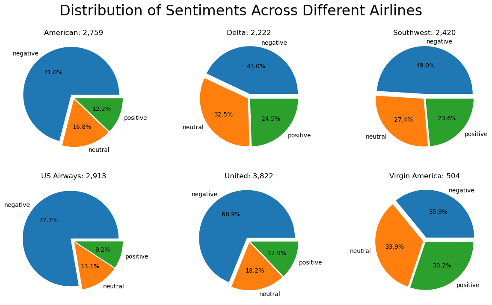
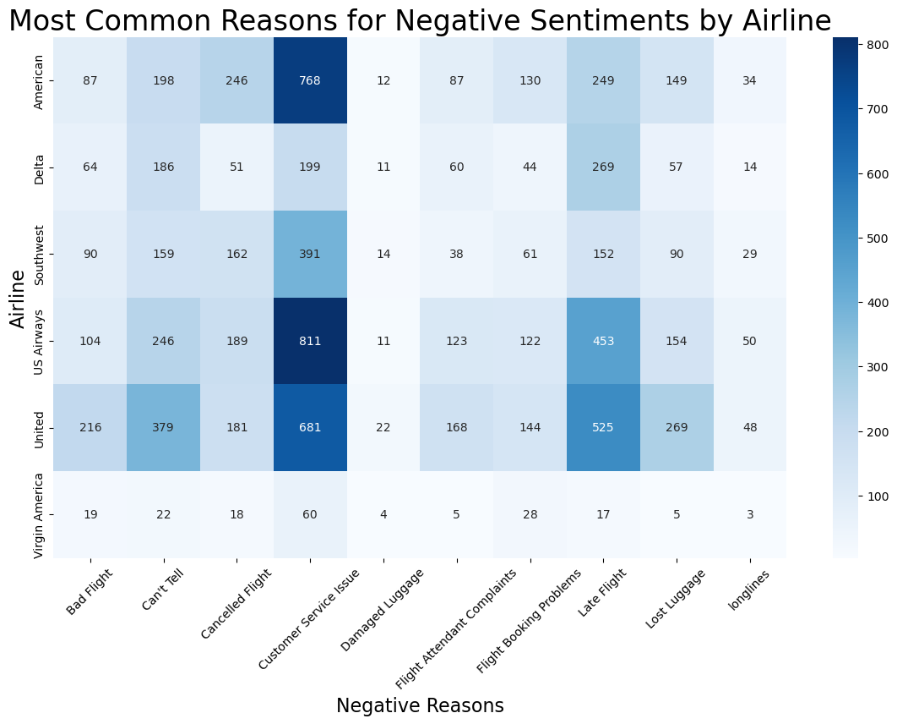

# Sentiment Analysis of Airline Tweets: From Data Exploration to Production Implementation

This project focuses on analyzing Twitter data related to major airline companies, gathered from February 2015. The main objectives and processes of the project are:

+ **Data Exploration:** Analyzing the sentiment distribution across airlines, identifying common reasons for negative sentiments for each airline, and exploring the relationship between sentiment confidence and retweet count.
+ **Sentiment Analysis Model:** Building a machine learning model to predict tweet sentiments, involving data preprocessing, model refinement, and evaluation.
+ **Path to Production:** Theoretical discussion on deploying the model in a production environment, covering ongoing training, data quality assurance, performance monitoring, and integration into web services.

## Part 1 - Data Visualisation

### Overview
In this part, we focus on visualizing and analyzing the sentiment distribution within a dataset of tweets related to various airline companies. The following key areas are explored:

- Distribution of Sentiment Across Airlines
- Analysis of Negative Tweet Reasons by Airline
- Relationship Between Sentiment Confidence and Retweet Count

Each analysis is supported by appropriate visualizations and insights derived from the data.

### Distribution of Sentiment Across Airlines

#### Objective
Compare the distribution of sentiments (positive, neutral, negative) across different airlines.

#### Approach
[Describe the methodology used for the analysis and the type of visualizations created.]

#### Results

[Provide a brief summary of the findings from the visualization.]

### Analysis of Negative Tweet Reasons by Airline

#### Objective
Identify the most common reasons for negative sentiments towards each airline.

#### Approach
[Detail the methodology and the types of visualizations used for this analysis.]

#### Results

[Summarize the key insights gained from this analysis.]

### Relationship Between Sentiment Confidence and Retweet Count

#### Objective
Examine if tweets with higher sentiment confidence are more likely to be retweeted.

#### Approach
[Explain the approach and visualization techniques used for this analysis.]

#### Results

[Discuss the findings and any correlations observed.]

### Conclusion
[Provide a brief overall conclusion of the data visualization part, summarizing the key insights and their implications.]

### Additional Resources
- [Jupyter Notebook](path/to/jupyter_notebook.ipynb)
- [Data Source](path/to/data_source.csv)

## Part 2 - Sentiment Analysis Model

## Part 3 - Path to Production
